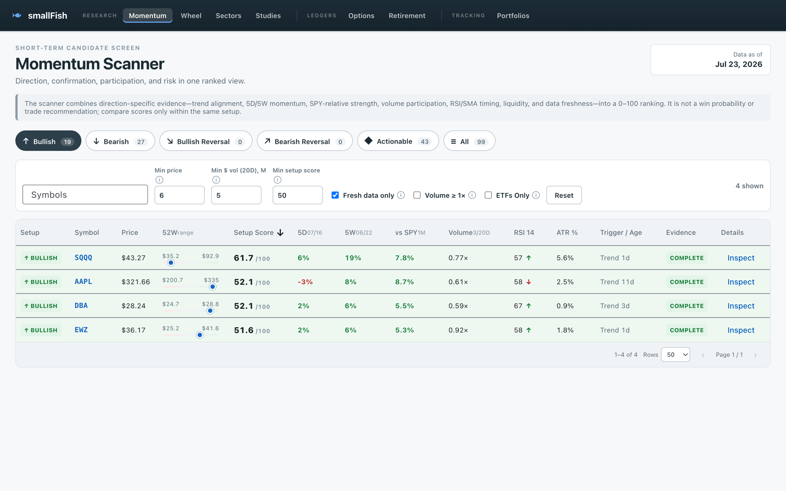
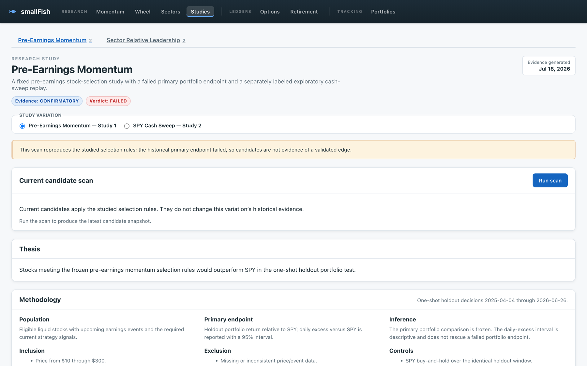
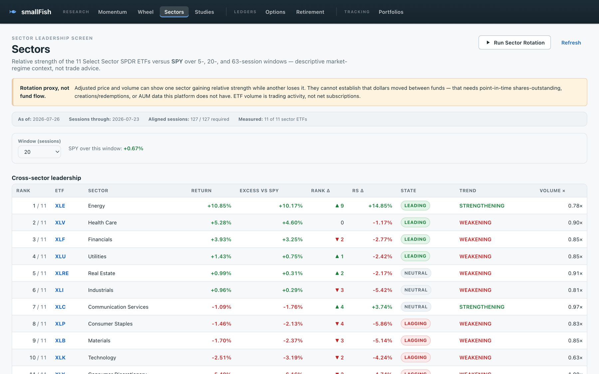
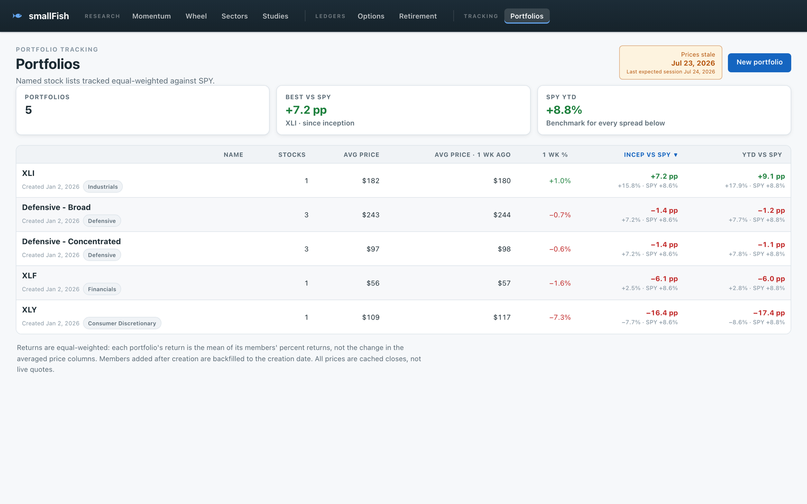
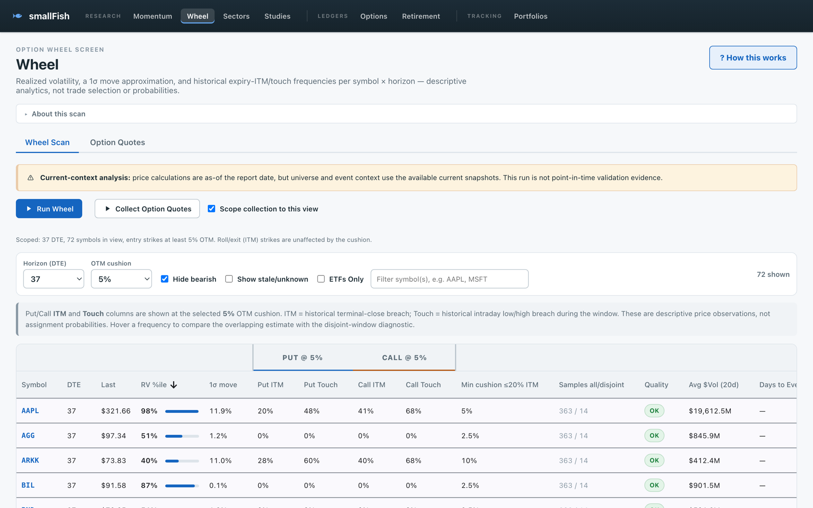
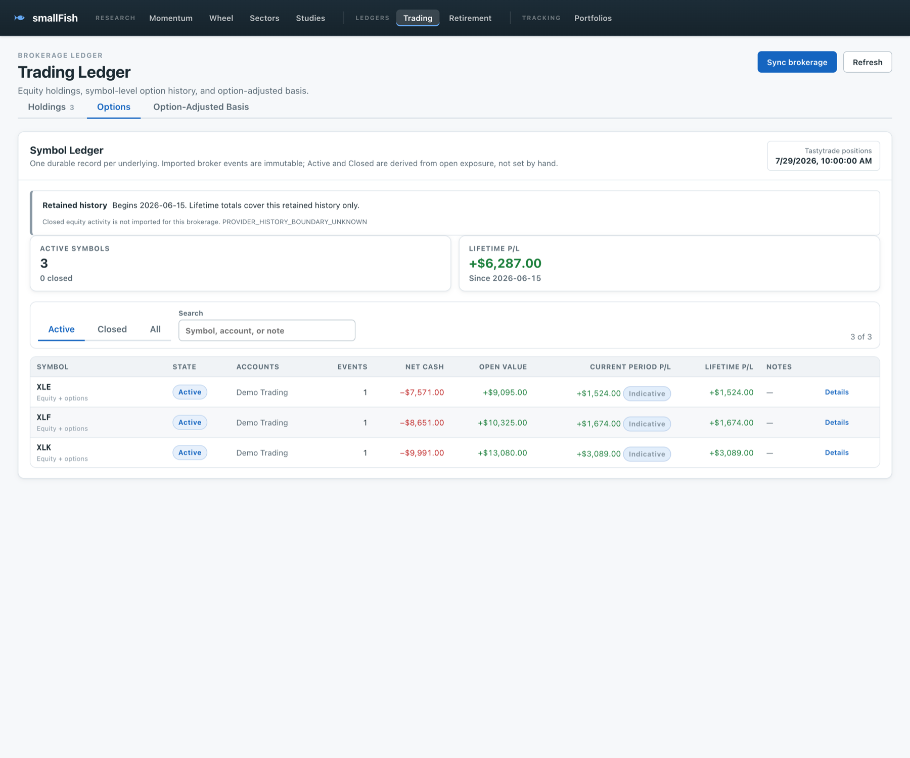
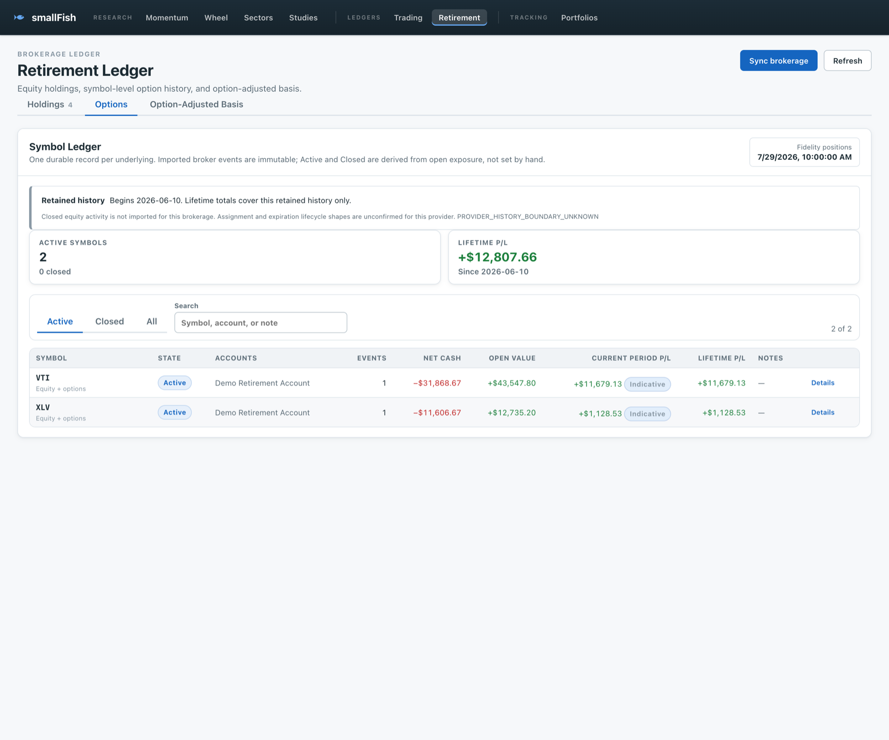

# smallFish

A local stock-research and options-wheel workbench. A Python data pipeline, a
FastAPI service, and an Angular dashboard for researching stocks and ETFs,
screening strategies, and — optionally — tracking your own brokerage positions.

> **Research software, not financial advice.** smallFish produces screens,
> scores, and historical studies. It does not predict returns, and nothing it
> shows is a recommendation to buy or sell anything. Market data comes from
> free third-party providers and may be delayed, incomplete, or wrong. You are
> responsible for your own investment decisions.

**Status:** works, actively used, single-user. There is no authentication layer;
run it on your own machine. See [`docs/SUPPORT_MATRIX.md`](docs/SUPPORT_MATRIX.md).



## What it does

Everything here works with **no account and no API key**:

- **Momentum Scanner** — ranks stocks and ETFs by trend alignment, 5-day and
  5-week momentum, SPY-relative strength, volume participation, and RSI/SMA
  timing.
- **Sectors** — an 11-sector leadership snapshot against SPY. A relative-strength
  proxy, explicitly not a measured fund flow.
- **Wheel** — screens cash-secured-put candidates and explains the mechanics.
- **Portfolios** — track named symbol lists with returns and sector exposure.
- **Stock Detail** — price history, technical analysis, and classification.
- **Research Studies** — the project's own frozen backtests, published with their
  verdicts, evidence levels, and provenance. Including the ones that failed.

<p align="center">
  
  
</p>

<p align="center">
  
  
</p>

With a brokerage connected, the ledgers show positions, group P/L, and
portfolio risk. Both frames below use **synthetic demonstration data** — no real
account or position:

<p align="center">
  
  
</p>

Both ledgers show an actionable optional-setup card until a brokerage is
connected. More in [`docs/screenshots/`](docs/screenshots/README.md).

Optional, each independently:

| Feature | Needs | Without it |
|---|---|---|
| Upcoming earnings dates | Finnhub API key (free) | The Pre-Earnings Momentum scan cannot run, and Wheel candidates and ledger positions show their earnings window as unknown |
| Options ledger, quotes, Greeks, beta | Tastytrade (read-only) | Options page shows an optional-setup card |
| Retirement holdings | SnapTrade — Fidelity and others connect *through* it | Retirement page shows an optional-setup card |

smallFish never receives your brokerage password, and never places, modifies, or
cancels an order. See [`docs/BROKERAGES.md`](docs/BROKERAGES.md).

## Quickstart

Five minutes, no credentials. Requires Python 3.12+, Node 24 LTS, and Git.

```bash
git clone https://github.com/nhznl/smallFish.git
cd smallFish
./setup.sh
```

`setup.sh` is non-interactive and safe to rerun. It checks your runtimes,
creates `app.env` and the runtime directories, builds both Python virtual
environments, and installs UI dependencies. It never asks for an API key.

```bash
./commands.sh doctor
```

Reports runtimes, configuration, data, and integrations. Secrets are masked and
it makes no network call. Optional integrations show as `[ off]` — that is a
valid state, not a failure.

```bash
./commands.sh bootstrap-data
```

Downloads starter price history. Expect **2–5 minutes** for ~99 symbols across
two years, throttled to be polite to the provider.

```bash
./commands.sh build-ui
./commands.sh server
```

Open <http://127.0.0.1:8000>.

### What bootstrap-data downloads

Every ETF in `utilities/config/universe.yaml#etf_seed` (97 today, including SPY
and the eleven sector SPDRs) plus `AAPL` and `MSFT`, for **January 1 of last
year through today**. It writes the same validated per-year cache the scraper
uses.

Rerunning is cheap: anything already cached is skipped rather than
re-downloaded, so a second run finishes in under a second without touching the
network. Use `--refresh` to force one, or `./commands.sh scrape` to add new
sessions to what you already have.

On a first run it also seeds five portfolios — two defensive baskets and three
single-sector ETFs — so the Portfolios view opens with something to look at.
They are ordinary portfolios: rename, edit, or delete them freely. A rerun will
not bring back ones you delete.

Data comes from Yahoo Finance via `yfinance`. A symbol can legitimately return
nothing — delisted, renamed, or listed after the window began. Those are
reported, not fatal. Nothing downloaded is committed; see
[`docs/DATA.md`](docs/DATA.md).

To go further: `./commands.sh universe` refreshes the full index universe
(several thousand symbols, much slower), then `./commands.sh scrape` fills it in.

## Run modes

**Single server** — Angular built into FastAPI, one process:

```bash
./commands.sh build-ui
./commands.sh server --no-reload
```

**Frontend development** — two terminals, with hot reload on <http://localhost:4200>:

```bash
./commands.sh server
```

```bash
cd stock-app-ui && npm start
```

## Optional services

| Service | Setup | Guide |
|---|---|---|
| Finnhub | Add `FINNHUB_API_KEY` to `app.env` | [`docs/CONFIGURATION.md`](docs/CONFIGURATION.md) |
| Tastytrade | `./setup-brokerages.sh setup tastytrade` | [`docs/BROKERAGES.md`](docs/BROKERAGES.md) |
| Fidelity / other retirement broker | `./setup-brokerages.sh setup snaptrade` | [`docs/BROKERAGES.md`](docs/BROKERAGES.md) |

Check state at any time with `./setup-brokerages.sh status` — local only, masked,
no network call.

## Architecture

```
Angular dashboard  ──HTTP──▶  FastAPI  ──reads──▶  data/  ◀──writes──  utilities/ + studies/
 stock-app-ui/                stock-app/           generated            batch pipeline
                                  │                                          │
                                  ├──▶ services/ ◀───────────────────────────┤
                                  └──▶ models/ ◀─────────────────────────────┘
                                      shared provider transport + stdlib contracts
```

Dependencies point one way. The API reads generated artifacts and never imports
the batch runtime; both runtimes may use `services/` for raw provider transport
and `models/` for contracts.

| Directory | Purpose |
|---|---|
| [`utilities/`](utilities/README.md) | Batch pipeline: scraper, universe, indicators, options. Its own Python environment. |
| [`studies/`](studies/README.md) | Research studies and their materialization. Shares the utilities environment. |
| [`models/`](models/README.md) | Standard-library-only data contracts shared by everything. |
| [`services/`](services/README.md) | Read-only provider credentials, SDK sessions/clients, streaming/paging, and raw payload transport. |
| [`stock-app/`](stock-app/README.md) | FastAPI backend and API tests. Its own Python environment. |
| [`stock-app-ui/`](stock-app-ui/README.md) | Angular 22 dashboard. |
| `tools/` | Repository tooling: setup preflight, doctor, brokerages, secret scan. Standard library only. |
| `data/`, `logs/` | Generated at run time and git-ignored, apart from the bundled study artifacts. |

Two Python environments is deliberate: the API stays independent of the heavier
batch runtime. See [`docs/ARCHITECTURE.md`](docs/ARCHITECTURE.md).

## Common commands

Full list: `./commands.sh` with no arguments.

| Command | Purpose |
|---|---|
| `./commands.sh doctor` | Local state: runtimes, config, data, integrations |
| `./commands.sh bootstrap-data` | Starter price history for this year and last |
| `./commands.sh server [--no-reload]` | Start FastAPI on port 8000 |
| `./commands.sh build-ui` | Build Angular into `stock-app/static/` |
| `./commands.sh scrape` | Incremental price update |
| `./commands.sh scrape-history` | Full-year backfill |
| `./commands.sh universe` | Refresh the full stock and ETF universe registry |
| `./commands.sh wheel` | Options-wheel candidate screen |
| `./commands.sh chains` | Discover Wheel contracts, archive Tastytrade quotes |
| `./commands.sh sector-rotation` | Recompute the sector leadership snapshot |
| `./commands.sh studies build\|validate` | Materialize or validate Research Studies JSON |
| `./commands.sh scan [earnings]` | Run a strategy scan from the current earnings cache |
| `./commands.sh fetch` | Fetch upcoming earnings (needs `FINNHUB_API_KEY`) |
| `./commands.sh ensure-events` | Reuse a fresh upcoming-earnings cache or conditionally refresh it |
| `./commands.sh scrape-retry` | Re-run the previous scrape's failures |
| `./commands.sh verify-premiums [run-id]` | Offline integrity check of a quote archive |
| `./commands.sh earnings-history` | Fetch historical earnings dates |
| `./commands.sh backtest [earnings]` | Strategy walk-forward backtest |
| `./commands.sh event-backtest [earnings]` | Strategy event-study backtest |
| `./commands.sh sector-rotation-study[-v2]` | Reproduce a frozen study run (`--verify-run PATH`) |

## Testing

The same checks CI runs:

```bash
stock-app/.venv/bin/python -m pytest -q --rootdir=stock-app stock-app/tests
utilities/.venv/bin/python -m pytest -q utilities/tests
cd stock-app-ui && npm run build && npm run test:ci
```

No test contacts a provider. Fetchers are injected and fixtures are committed,
so the suites pass offline.

## Contributing

Start with [`CONTRIBUTING.md`](CONTRIBUTING.md). Coding agents should read
[`AGENTS.md`](AGENTS.md) first.

Never include a credential, a real account identifier, or real position data in
an issue, a pull request, or a screenshot.

## Data, privacy, and security

- Everything runs locally. smallFish has no telemetry and no backend service of
  its own.
- `app.env` holds your credentials, is git-ignored, and is created at mode 0600.
- Brokerage access is read-only. Revocation is documented in
  [`docs/BROKERAGES.md`](docs/BROKERAGES.md).
- FastAPI binds to `127.0.0.1` and has **no authentication layer**. Do not expose
  it to the internet.
- Report a vulnerability privately: [`SECURITY.md`](SECURITY.md). Do not open a
  public issue for one.

## Status and roadmap

Working and in daily use. Known follow-ups, none of them blocking: Docker and
devcontainer support, native Windows outside WSL, and broader Angular test
coverage. [`Requirements.md`](Requirements.md) records what is still open,
deferred, or decided-and-closed.

## License

[MIT](LICENSE) © 2026 nhznl.

Third-party dependency and data-source terms are recorded in
[`docs/THIRD_PARTY_NOTICES.md`](docs/THIRD_PARTY_NOTICES.md). No market data is
redistributed by this repository.

## Acknowledgements

Built on FastAPI, Angular, pandas, and yfinance. Market data from Yahoo Finance;
optional data from Finnhub, Tastytrade, and SnapTrade. Index membership is
derived from public Wikipedia index pages at run time.
