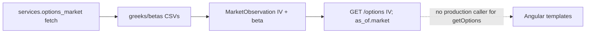

# Beta / Greek consumer measurement (Phase 7)

**Status:** 7a–7c complete (measurement only; no fetch/schema deletions)  
**Date:** 2026-07-30  
**Parent audit:** [`CODEBASE_ARCHITECTURE_AND_DEAD_CODE_REVIEW.md`](CODEBASE_ARCHITECTURE_AND_DEAD_CODE_REVIEW.md) item 7

## Goal

Document in-repo consumers of exact-contract Greeks/IV and market-metric beta by
layer, run a static evidence checklist for out-of-tree use, and record a
retain-vs-trim recommendation. This phase does **not** delete fetches, CSV
columns, JSON fields, or capability ids.

## Artifact map

| Ledger | Env override | Default under `$SFP_DATA_DIR` | Headers (value columns) |
|---|---|---|---|
| Trading Greeks/IV | `SFP_OPTIONS_GREEKS` | `ledger_trading/options_greeks.csv` | `implied_volatility`, `option_price`, `delta`, `gamma`, `theta`, `rho`, `vega`, plus identity/timestamps |
| Trading beta | `SFP_OPTIONS_BETAS` | `ledger_trading/options_betas.csv` | `beta`, `beta_updated_at`, plus identity/timestamps |
| Retirement Greeks/IV | `SFP_RETIREMENT_OPTION_GREEKS` | `ledger_retirement/option_greeks.csv` | Same Greek header family as trading |
| Retirement beta | `SFP_RETIREMENT_OPTION_BETAS` | `ledger_retirement/option_betas.csv` | Same beta header family as trading |

Path helpers live in [`stock-app/app/config.py`](../stock-app/app/config.py).
Trading headers are defined in
[`brokerages/activity_store.py`](../stock-app/app/brokerages/activity_store.py);
retirement headers in
[`brokerages/importers/held_option_market_data.py`](../stock-app/app/brokerages/importers/held_option_market_data.py).

## Writers, adapters, projections, capabilities

| Role | Location | What it does |
|---|---|---|
| Writer (trading) | [`activity_sync.py`](../stock-app/app/brokerages/activity_sync.py) | `fetch_greeks` / `fetch_underlying_metrics(…, metrics=("beta",))` via `services.options_market`; retain-prior-on-miss; sync count fields |
| Writer (retirement) | [`held_option_market_data.py`](../stock-app/app/brokerages/importers/held_option_market_data.py) | Same provider API for held SnapTrade legs; `call_coverage` selects which legs to fetch |
| Adapter | [`adapters/tastytrade.py`](../stock-app/app/brokerages/adapters/tastytrade.py), [`adapters/snaptrade.py`](../stock-app/app/brokerages/adapters/snaptrade.py) | CSV → `MarketObservation`: maps **IV** and **beta** only; delta…vega CSV columns are **not** mapped |
| Projection (values) | [`projections/options.py`](../stock-app/app/brokerages/projections/options.py) | Emits `implied_volatility` / `implied_volatility_observed_at` on `GET …/options` items |
| Projection (timestamps) | [`projections/envelope.py`](../stock-app/app/brokerages/projections/envelope.py) | `as_of.market` from observation `observed_at` / provenance (any market observation, including beta) |
| Capability | [`capabilities.py`](../stock-app/app/capabilities.py) | `tastytrade` provides Greeks/beta language; `retirement-risk` is market-data enrichment (needs Tastytrade for exact-contract inputs) |

### Symbol Ledger nuance

[`call_coverage.py`](../stock-app/app/brokerages/call_coverage.py) classifies open short
calls so held-option market sync knows which legs to fetch. That is **selection
for materialization**, not consumption of Greek or beta **values**. Symbol
Ledger / Option-Adjusted Basis projections do not read IV, beta, or Greek
scalars. Combined-ledger UI may show `as_of.market` timestamps only.

## Layer A / B / C



| Layer | What happens | In-repo live use |
|---|---|---|
| **A** Fetch + materialize | Full Greek scalars + IV + beta written to trading and retirement CSVs | Sync, importers, tests/fixtures |
| **B** Adapter | IV + beta into `MarketObservation`; **delta…vega not mapped** | Adapters only |
| **C** API/UI | IV on `GET …/options`; timestamps on `as_of.market`; sync count fields | Angular does **not** display IV/beta/Greek values; `getOptions()` unused in production components. `as_of.market` appears on combined-ledger copy |

**Explicit boundary:** Greek scalars (`delta`…`vega`) and beta **values** stop at
Layer A (CSV) / Layer B (beta only on the observation). Only **IV values** and
**market timestamps** reach Layer C JSON. Angular production templates bind
neither IV nor beta/Greek fields.

## Angular gap

| Surface | Status |
|---|---|
| `BrokerageOptionItem.implied_volatility*` in [`brokerage.ts`](../stock-app-ui/src/app/model/brokerage.ts) | Typed; not bound in templates |
| `BrokerageService.getOptions()` | Defined; called only from its unit spec |
| Production components | Use Symbol Ledger / holdings / combined routes — never `getOptions()` |
| Templates | No `implied_volatility`, beta, or Greek field binds |

## Evidence checklist (7b)

Static run against this machine and the repository only. No provider network.
Hit counts only; no absolute data-dir or account paths.

| Check | Result |
|---|---|
| 1. Repo env-var file hits | `SFP_OPTIONS_GREEKS` 6; `SFP_OPTIONS_BETAS` 6; `SFP_RETIREMENT_OPTION_GREEKS` 2; `SFP_RETIREMENT_OPTION_BETAS` 3 (config, examples, tests, docs) |
| 1b. Repo CSV basename file hits | `options_greeks.csv` / `options_betas.csv` 12 each; `option_greeks.csv` / `option_betas.csv` 6 each — all in-repo writers, adapters, docs, tests |
| 1c. Home-dir-safe search (Documents / Desktop / Downloads / projects, excl. this checkout; depth-capped; secrets trees skipped) | Documents/Desktop/Downloads: **0**. Other projects: **12** files, all under one sibling checkout (`smallFishPrivate`) — docs/tests/config mirrors, not proven independent value consumers |
| 2. `studies/` / `utilities/` production readers of these ledger CSVs | **None** |
| 3. Angular production `getOptions()` / greek-beta binds | **None** (service + spec only; no template binds) |
| 4. HTTP access logs; notebooks outside searchable trees | **Unknown** (owner evidence required) |

## Consumer status

| Layer / field family | Status |
|---|---|
| A — CSV Greek scalars (delta…vega) | In-repo live (writers/tests) · In-repo unused as values beyond CSV · External unknown |
| A — CSV IV | In-repo live (writers → adapters → `/options`) · External unknown |
| A — CSV beta values | In-repo live (writers → adapters) · In-repo unused as Layer C values · External unknown |
| B — `MarketObservation.implied_volatility` | In-repo live (→ options projection) · External unknown |
| B — `MarketObservation.beta` | In-repo live (adapters; feeds `as_of.market` timestamps) · In-repo unused as a displayed/API value field · External unknown |
| B — Greek scalars on observation | In-repo unused (not mapped) |
| C — `GET …/options` IV fields | In-repo unused (API exists; no Angular production caller) · External unknown |
| C — `as_of.market` | In-repo live (envelope + combined-ledger UI) |
| C — Sync `greeks_*` / `betas_*` counts | In-repo live (sync response / CLI presentation) |

## Recommendation (7c)

**Retain Layer A materialization and `services.options_market` fetches** until the
owner closes **External unknown** (access logs / out-of-tree notebooks) or
explicitly authorizes a follow-up trim.

A **future** trim candidate (separate phase, owner gate) would be: stop
persisting unused Greek scalar columns and/or beta **values** while keeping IV
(and `as_of.market` semantics that depend on market observations)—only after
external consumers are ruled out.

**Phase 7 does not remove** CSV columns, sync fetches, `/options` IV fields, or
capability ids.

## Explicit non-goals

- Deleting or narrowing `fetch_greeks` / beta metrics / CSV headers
- Changing brokerage JSON or Angular models
- Phase 8+ work (unused helpers, lazy routes, company-info exception, etc.)
- Merging runtimes or touching frozen studies

## Verification

```bash
python3 tools/check_docs.py
git diff --check
python3 tools/scan_secrets.py
```
