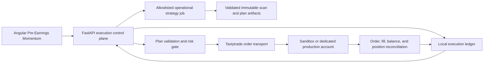
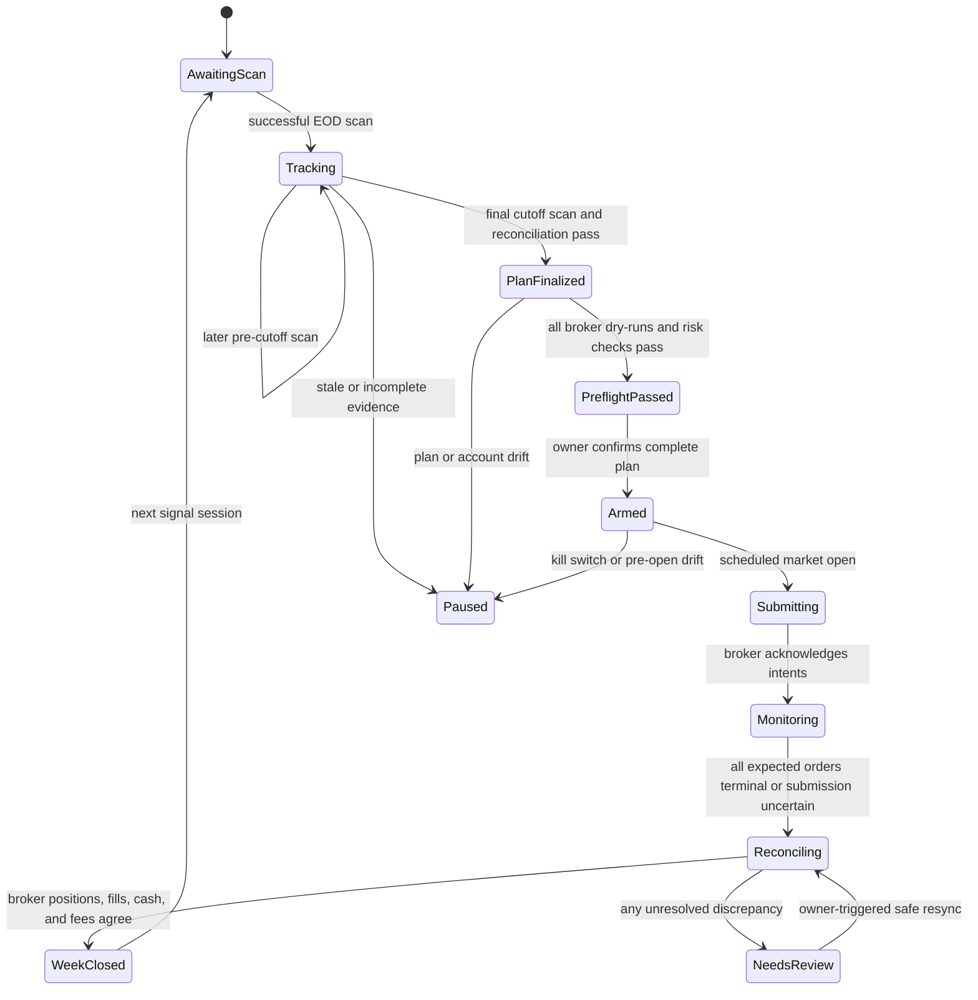

# Study 4 live management and execution design

**Status:** implemented and gated. Ordinary brokerage APIs remain read-only.
Study 4 live execution is a separately unlocked bounded context. Production
submission defaults to disabled. This document remains the product contract;
frozen Study 4 specifications and published results are unchanged.

**Protocol:** `pre-earnings-post-event-weekly-batch-risk-on-v1`, operated as
`study4-live-v1`

**Scope:** one dedicated Tastytrade account, long US equities and SPY only

## 1. Objective

Build a local smallFish workflow that:

1. runs the Study 4 Risk-On evaluation after each eligible session close;
2. preserves the week's changing recommendations and sticky exit decisions;
3. freezes the final portfolio plan after the session before the weekly
   execution session;
4. obtains one explicit owner confirmation for the complete batch;
5. submits the batch to Tastytrade immediately after the weekly market open;
6. reconciles intended orders, broker orders, fills, cash, and positions;
7. treats the reconciled broker account as the true starting state for the next
   week; and
8. records daily strategy growth and an identically cash-flowed SPY benchmark.

The feature is an execution and recordkeeping tool, not a new research result.
Study 4 remains `NO_VERDICT` / `EXPLORATORY`, with static-universe,
survivorship, simulated-execution, and slippage limitations visible wherever a
batch is approved or performance is compared.

## 2. Owner decisions

The initial product contract is:

| Decision | Approved behavior |
|---|---|
| Strategy | Study 4 Risk-On variant |
| Account | Dedicated Tastytrade account with no starting holdings |
| Instruments | Long US equities and SPY; no options, shorts, margin-created exposure, crypto, futures, or fractional shares |
| Capital | Owner-configured fixed target, changeable only through an explicit dated capital reset |
| Weekly timing | Exact Study 4 holiday schedule |
| Entries | IOC limit at 103% of the final decision close |
| Unfilled entry | Rejected for the week; never chased or retried later |
| Cash staging | Residual eligible capital held in whole SPY shares |
| Approval | One final confirmation bound to the complete batch |
| Truth after execution | Tastytrade positions, fills, fees, and cash after reconciliation |
| Contributions/withdrawals | No withdrawals before year end; every external cash flow is recorded explicitly |
| Environments | Tastytrade sandbox first, then an explicitly unlocked production account; no shadow-trading phase |

The production pilot should use a temporary active bucket of:

```text
min(10% of the intended target bucket, $10,000)
```

This is an operational loss-containment default, not an investment
recommendation. The owner must enter and approve the actual pilot ceiling. If
that ceiling cannot satisfy the frozen $1,000 minimum-lot rules, the app refuses
the stock allocation rather than changing the strategy.

## 3. Fidelity boundary

### 3.1 Rules that remain identical

The operational evaluator must use the committed Study 4 configuration and
preserve these rules without UI overrides:

- `momentum-v3` scoring;
- `BULLISH_CONTINUATION` and `setupScore > 50`;
- Risk-On entries only, using SPY above a rising 50-session SMA with a
  five-session slope;
- predicted earnings two through five weeks away;
- $10 through $500 decision-close price;
- 20-session average volume of at least 4,000,000 shares;
- 20-session average dollar volume of at least $10,000,000;
- at most three open-plus-pending positions per sector;
- equal whole-share stock allocation with a $1,000 minimum target and $5,000
  maximum principal;
- entry limit equal to 103% of the final decision close;
- 30-calendar-day re-entry pin after a bearish-trend or capital-scaled-drawdown
  exit;
- the frozen capital-scaled close-drawdown rule, ranging from 20% at $1,000 to
  10% at $5,000;
- sticky intraweek exits;
- post-event floor and maximum T+7 holding rules; and
- stock exits, necessary SPY funding sales, stock entries, and residual SPY
  purchases in that order.

The existing published study code and artifacts stay unchanged. A new
operational implementation must prove parity against fixed Study 4 fixtures;
the FastAPI runtime must not import `studies/` or `utilities/`.

### 3.2 Unavoidable live-execution difference

The historical engine observes a daily bar's Friday opening price and treats an
entry as filled at that price when it is no higher than the 103% limit. The live
API does not offer the simulator's omniscient atomic opening fill.

`study4-live-v1` therefore uses the closest approved convention:

- arm the already-confirmed batch before the scheduled open;
- submit at or immediately after the exchange reports the regular session open;
- submit stock entries as IOC limit orders at the frozen 103% cap;
- treat any unfilled quantity as rejected for the week; and
- preserve actual broker fill timestamps, prices, quantities, and fees.

This difference is labeled in every performance report. Live results must not
be spliced into, used to retune, or represented as a continuation of the
historical Study 4 curve.

## 4. Trading-calendar contract

The system derives sessions from an exchange calendar, never from weekday
arithmetic.

- In a normal week, Thursday close is the final decision cutoff and Friday open
  is execution.
- If Friday is a market holiday, Wednesday close is the final cutoff and
  Thursday open is execution.
- If another holiday removes the normal cutoff, use the last open session before
  that week's final open session.
- The execution session's close marks portfolio value but creates no new signal.
- The next signal opportunity is the first later market session.
- An early close does not change the regular opening time, but it changes the
  EOD job deadline.

The calendar version and computed cutoff/execution timestamps are persisted in
the weekly record. If the calendar is unavailable, contradictory, or changes
after finalization, execution fails closed for owner review.

## 5. Architecture

The management experience is part of the Angular/FastAPI app, but money-moving
code is a separately gated bounded context. Ordinary brokerage routes and
components remain read-only.



### 5.1 Operational strategy package

A new utilities-runtime package owns current-market Study 4 evaluation. It may
reuse shared pure contracts, but it must not mutate the frozen study or its
published evidence. It writes versioned, checksum-protected JSON artifacts
under `SFP_DATA_DIR` containing:

- input timestamps and hashes;
- strategy/configuration hash;
- calendar version and intended execution session;
- market regime and its dated inputs;
- every evaluated symbol and rejection reason;
- held-position exit evaluation;
- candidate ranks and provisional allocations; and
- the final selected quantities and limit prices.

FastAPI triggers this package through an allowlisted command and reads its
artifact. It never imports the utilities or studies runtime.

### 5.2 FastAPI execution control plane

A new `stock-app/app/execution/` bounded context owns:

- weekly lifecycle orchestration;
- capital-target versions;
- plan validation and finalization;
- risk checks;
- confirmation tokens;
- order intent and status persistence;
- Tastytrade submission sequencing;
- reconciliation; and
- performance accounting.

This is local-only functionality. FastAPI remains bound to loopback, and the
execution router is absent unless an explicit execution mode is configured.

### 5.3 Provider transport

Order transport belongs behind a narrow Tastytrade interface rather than in a
router or strategy module. It supplies raw calls for:

- account and trading-status checks;
- balances, positions, orders, transactions, and fills;
- order dry-run;
- order submission with `external-identifier`;
- order lookup and status streaming/polling; and
- cancel where a nonterminal safety action requires it.

The transport uses OAuth2, sends the required product/version `User-Agent`, and
pins an explicitly supported Tastytrade API version. Sandbox and production
credentials and base URLs are separate types/configurations rather than a
caller-supplied string.

The implementation must update the repository's current read-only standing
decision and architecture tests deliberately. Existing read consumers retain
their contracts; write methods are available only to the execution bounded
context.

### 5.4 Durable local ledger

Use a dedicated SQLite database under `SFP_DATA_DIR`, in WAL mode with strict
transactions and restrictive file permissions. CSV is unsuitable for atomic
multi-order state transitions and crash recovery.

No credential, OAuth token, brokerage password, or raw account number is
stored. The database uses an owner-defined account alias plus a one-way account
fingerprint. Logs and API responses redact provider identifiers and raw payload
fields not needed for reconciliation.

## 6. Weekly state machine



Only one weekly cycle may be active. Every transition is transactional and
append-only-audited. Restarting the app resumes the persisted state rather than
recreating or resubmitting the batch.

## 7. Daily and weekly workflow

### 7.1 Initial setup

The owner:

1. selects `sandbox` or `production`;
2. selects the dedicated account by a masked label;
3. records the target bucket and, in production, the hard pilot cap;
4. runs a broker sync and verifies there are no positions, open orders, or
   unexpected transactions;
5. confirms that cash is at least the active bucket; and
6. activates the strategy/configuration hash.

An account with an option, short position, borrowed exposure, unexpected
security, or pre-existing order cannot be activated.

### 7.2 EOD tracking sessions

After every eligible close before the week's execution session:

1. Reconcile the broker account first.
2. Refresh and validate EOD prices and the earnings calendar.
3. Evaluate held positions and latch any exit trigger.
4. Run the exact Risk-On candidate scan.
5. Compute a provisional allocation from the reconciled portfolio.
6. Persist the complete snapshot; never overwrite an earlier day.
7. Display changes from the prior scan: added, retained, dropped, blocked,
   selected, held, or exit latched.

Provisional quantities help the owner anticipate Friday but are not executable.
Each row distinguishes the dated decision close used by the strategy from an
optional timestamped broker quote used only as current context.

### 7.3 Final decision cutoff

At the final pre-execution close, the job:

1. reconciles true positions, cash, open orders, and fills;
2. re-evaluates and latches exits;
3. revalidates, ranks, and allocates candidates from the real portfolio state;
4. freezes an immutable plan;
5. computes entry quantities using the close and 103% reservation price;
6. estimates stock-sale proceeds and the SPY shares needed to fund the maximum
   reserved entry cash;
7. records the residual-SPY formula; and
8. hashes the plan, inputs, strategy, account fingerprint, environment, and
   capital version.

Any later data or account change invalidates the plan; it is never edited in
place.

### 7.4 Pre-open review and single confirmation

Before the weekly open, the app refreshes broker state and dry-runs every
deterministic order that can be known in advance. It displays:

- environment and masked account;
- execution time and expiry behavior;
- strategy and plan hashes;
- every planned sell and buy;
- current shares, target shares, delta, reference close, limit, and maximum
  notional;
- expected SPY funding sale and residual-SPY formula;
- dry-run buying-power and fee effects;
- data freshness and market-regime evidence;
- all warnings and deviations; and
- the production pilot ceiling and worst-case batch notional.

One confirmation arms exactly that plan. The confirmation is single-use,
expires at the scheduled open, and is cryptographically bound to the plan hash,
account fingerprint, environment, limits, and execution session. Any mutation
requires a new plan, new dry-runs, and new confirmation.

### 7.5 Opening execution

When the regular session opens, submit in frozen priority order:

1. **Stock exits:** sell the reconciled long quantity. An exit is never allowed
   to exceed broker-held shares.
2. **SPY funding:** sell only the whole SPY shares required by the accepted
   maximum entry reservations after actual exit proceeds.
3. **Stock entries:** submit ranked single-leg equity IOC limits at 103% of the
   decision close. Lower ranks may be reduced or omitted only by the frozen
   affordability rule; no new symbol can be substituted.
4. **Residual SPY:** after all stock IOC orders are terminal and cash is
   reconciled, buy the maximum affordable whole SPY shares.

The UI streams each intent independently. One order's rejection does not hide
the rest of the batch, but any uncertain sell/funding state blocks dependent
buys until reconciled.

If the app is unavailable or the batch is not armed at the scheduled open, the
system does not perform a late catch-up trade. It records a missed execution and
skips the batch for owner review. Restarting before the open may resume an armed
batch only after the pre-submit account and plan-drift checks pass.

### 7.6 EOD reconciliation

The owner uses **Final sync** after Friday close (or Thursday close in a
Friday-holiday week). The app fetches all account positions, balances, orders,
transactions, and fills for the execution window and compares:

```text
immutable recommendation
    -> submitted broker order
        -> broker fill(s)
            -> final broker position and cash
```

The broker snapshot becomes the next week's starting truth only when:

- every submitted intent has a known terminal or explicitly accepted state;
- fill quantities aggregate to the position deltas;
- fees and net cash movements reconcile within defined currency precision;
- no unknown position or order exists; and
- the account remains long-only and within the active bucket/cap.

Otherwise the week becomes `Needs review`; the app preserves both intended and
actual state and blocks new entries. Read-only sync and risk-reducing exits
remain available.

## 8. Order lifecycle and retry policy

Each intended order receives one UUID `external-identifier` before dry-run.
Tastytrade does not deduplicate repeated submissions, so this identifier is a
correlation handle, not an idempotency guarantee.

### Clear outcomes

- Acknowledged order: persist the broker order ID and follow it to a terminal
  state.
- Explicit `4xx`/dry-run rejection: do not submit or retry; show the safe broker
  reason without logging secrets.
- IOC unfilled/cancelled/expired: final for the week; do not chase.
- Filled: re-fetch until all fill records are present, then reconcile quantity,
  price, fee, and position.

### Uncertain outcomes

For a timeout, connection loss, or `5xx` after submission:

1. mark the intent `SUBMISSION_UNKNOWN`;
2. query live and recent broker orders for the same `external-identifier`;
3. attach the existing order if found;
4. repeat bounded reads with backoff if the account stream may be lagging; and
5. resubmit only if the order is still absent and the approved execution window
   is still valid.

If uncertainty remains, require owner review. Never generate a new identifier
or blindly retry an order.

## 9. Risk gates

Every preflight and the final pre-submit check must pass all gates:

- execution mode explicitly enabled;
- environment in UI, token issuer, API base URL, and account fingerprint agree;
- production account equals the configured dedicated account;
- strategy/configuration/plan hashes agree;
- current time is within the computed weekly execution window;
- regular market session is open;
- EOD price and earnings evidence is complete and within its freshness policy;
- final Risk-On classification is known and remains the one used by the plan;
- no unexpected position, option, short, fractional quantity, or open order;
- broker trading status permits the action;
- current positions and cash equal the plan's starting snapshot;
- every symbol is an allowed US equity or SPY;
- every sell is no larger than the owned quantity;
- every stock buy obeys its approved quantity and 103% limit;
- the broker dry-run confirms that IOC is accepted for the equity order; if it
  is not, launch is blocked rather than silently changing the order to DAY;
- per-order, batch, daily, strategy, and production-pilot caps pass;
- no order intent has already been submitted;
- no unresolved reconciliation exists; and
- the global kill switch is not active.

The kill switch blocks new submissions immediately. It does not liquidate the
account automatically. A separate risk-reducing action may cancel nonterminal
orders or submit already-approved exits after displaying exactly what it will
do.

## 10. Capital-target semantics

The owner-configured target is a versioned capital instruction, not an editable
number silently applied to old history.

- `target_bucket` is the desired funded strategy capital.
- `active_bucket` is the amount currently authorized for trading, capped by the
  production pilot limit where applicable.
- `actual_equity` is reconciled broker cash plus marked positions.
- Gains and losses compound in `actual_equity`; the app does not sell gains
  merely because equity exceeds the original target.
- An upward reset becomes active only after matching cash is visible at the
  broker and is recorded as an external contribution.
- A downward reset cannot pretend capital left the account. Because withdrawals
  are disallowed before year end, it remains scheduled until a year-end broker
  withdrawal is reconciled.
- A reset never rewrites quantities, returns, or the SPY benchmark before its
  effective timestamp.

## 11. Performance and accounting

### 11.1 Daily valuation

After every market close, persist:

- broker cash;
- stock and SPY quantities;
- dated closing marks and their source/freshness;
- stock market value, SPY market value, and total strategy equity;
- realized and unrealized P/L;
- broker-reported fees and modeled Study 4 costs as separate fields;
- external cash flows;
- daily and cumulative strategy return;
- drawdown from the strategy equity peak; and
- data-completeness status.

Missing or stale marks make the affected valuation unavailable; retrieval time
is never substituted for a missing quote timestamp.

### 11.2 SPY comparison

Maintain an independent virtual passive-SPY ledger:

- start at the first strategy execution using the same active capital;
- apply every later contribution or withdrawal at the same effective timestamp;
- buy whole SPY shares with the frozen modeled per-share cost and retain
  residual cash;
- value both paths on the same session calendar and dated prices; and
- never use the strategy account's real SPY cash-staging shares as the
  benchmark.

Display cumulative return, time-weighted return, annual return, volatility,
maximum drawdown, and excess return. Money-weighted return may be displayed
only when all external cash-flow dates and amounts are complete. The primary UI
shows actual broker-net strategy performance; a separate audit view shows the
frozen modeled-cost comparison used for protocol diagnostics.

## 12. Data model

The minimum durable schema is:

| Entity | Purpose and invariants |
|---|---|
| `strategy_versions` | Immutable protocol ID, configuration JSON, source reference, and SHA-256 |
| `capital_versions` | Dated target, active amount, production cap, cash-flow status, and approval |
| `weekly_cycles` | Calendar week, cutoff, execution session, state, environment, account fingerprint, and plan hash |
| `scan_snapshots` | One immutable EOD evaluation with input hashes and regime evidence |
| `scan_rows` | Every symbol's state, reasons, score inputs, event date, price, rank, and provisional quantity |
| `position_decisions` | Held-position evidence, sticky exit triggers, and intended execution session |
| `plans` | Immutable final plan, starting broker snapshot hash, aggregate reservations, and confirmation state |
| `plan_items` | Ordered stock-exit, SPY-funding, stock-entry, and SPY-residual instructions |
| `order_intents` | Stable UUID/external identifier, sanitized request hash, dry-run result, broker ID, and current state |
| `order_events` | Append-only normalized broker status observations |
| `fills` | Broker fill identity, quantity, price, timestamp, and fees; duplicate-safe import |
| `reconciliations` | Expected-versus-actual cash, orders, fills, and positions with discrepancy codes |
| `position_snapshots` | Immutable post-sync broker truth, including empty positions |
| `valuation_snapshots` | Daily strategy and benchmark marks, returns, drawdowns, cash flows, and confidence |
| `audit_events` | Append-only actor, action, timestamp, before/after hashes, result, and redacted diagnostics |

Raw provider payloads are not the durable contract. Persist the minimum
normalized fields needed for replay and audit, plus a hash of any ephemeral raw
response used during diagnosis.

## 13. API contract

Keep execution routes under an explicit namespace such as
`/api/execution/study4`:

| Method and path | Behavior |
|---|---|
| `GET /status` | Environment, capability, kill-switch state, setup checklist, active capital version, current cycle, next required action |
| `GET /cycles/{week}` | Weekly timeline, snapshots, immutable plan, order states, and reconciliation summary |
| `POST /cycles/current/scan` | Run the allowlisted EOD evaluator and materialize a new snapshot |
| `POST /cycles/current/finalize` | Reconcile and create an immutable final plan at the valid cutoff |
| `POST /cycles/current/preflight` | Reconcile again, dry-run plan orders, and return a short-lived confirmation challenge |
| `POST /cycles/current/confirm` | Consume the challenge and arm the exact plan once |
| `POST /cycles/current/execute` | Internal scheduled transition at market open; refuses arbitrary payloads |
| `POST /cycles/current/reconcile` | Read-only broker synchronization and discrepancy calculation |
| `POST /cycles/current/final-sync` | Owner-requested EOD closeout reconciliation |
| `POST /kill-switch` | Block or release new submissions; preserve read-only operations. Does not liquidate. |
| `POST /reset` | Wipe the local execution ledger and evaluator artifacts after an explicit `RESET` confirmation. Does not change broker positions. |
| `POST /capital-resets` | Create a dated target change; never edits history |
| `GET /performance` | Dated strategy and benchmark series plus calculation metadata |
| `GET /audit` | Redacted, paginated audit events |

There is no generic endpoint accepting arbitrary symbols, quantities, order
types, or account numbers. The execute endpoint accepts only the ID of a
server-stored, finalized, preflighted, confirmed plan.

## 14. Dashboard information architecture

Add a dedicated **Pre-Earnings Momentum** product route under a Strategies nav
group rather than placing order controls in Trading holdings or the Research
Studies result page. The live page explains that it implements Study 3 and
Study 4 and links to those research tabs.

### Overview

- prominent `SANDBOX` or `PRODUCTION` environment banner when configured;
- setup checklist of missing `SFP_STUDY4_*` items when the control plane is inert;
- next cutoff and execution timestamps;
- current lifecycle state and required action;
- target bucket, active bucket/cap, actual equity, cash, stock value, and SPY
  staging value;
- last successful scan, broker sync, and valuation timestamps; and
- kill-switch state, with copy that it blocks submissions and does not liquidate.

### Daily tracking

- Monday-through-cutoff snapshot tabs;
- current candidate list with strategy close, timestamped broker context price,
  provisional quantity, setup score, earnings date, sector, and status;
- Added / Retained / Dropped changes since the prior scan;
- held positions with entry evidence, current close, return, drawdown threshold,
  event anchor/floor/T+7 state, and sticky exit reason; and
- a drawer containing complete score components and rejection evidence.

### Weekly plan

- four ordered sections: stock exits, SPY funding, stock entries, residual SPY;
- current quantity, target quantity, delta, rank, limit, reservation, reason, and
  worst-case notional;
- explicit reconciliation and risk-check list; and
- immutable plan and input hashes in the audit drawer.

### Friday execute

- one final confirmation modal using the shared accessible modal;
- typed `PRODUCTION` acknowledgement only in production, while still remaining
  one confirmation action;
- per-order progress with plain-language and raw normalized statuses;
- no generic Retry button for uncertain submissions;
- **Reconcile first** as the only action on `SUBMISSION_UNKNOWN`; and
- a clear distinction between unfilled IOC, broker rejection, uncertain state,
  partial processing, and successful fill.

### Reconciliation

- side-by-side Intended, Submitted, Filled, and Final Position quantities;
- broker fill price/fees and resulting cash;
- categorized discrepancies with the exact next safe action; and
- **Final sync** after the execution-session close.

### Performance

- strategy-equity and passive-SPY growth chart from the operational start;
- actual broker-net and modeled-cost views kept distinct;
- cumulative/TWR return, annual return, drawdown, volatility, and excess return;
- capital-reset markers and excluded/unavailable dates; and
- drill-down from every weekly return to positions, fills, prices, and fees.

Use existing panels, stat strips, table shells, semantic badges, drawers,
modals, banners, skeletons, and design tokens. Color never carries order or risk
state alone. The route must work at desktop and narrow widths, with symbols
sticky in horizontally scrolling tables.

## 15. Sandbox and production rollout

### Phase 1: deterministic offline verification

- golden parity tests against Study 4 fixtures, including normal and holiday
  weeks;
- order-state replay tests for every status and restart point;
- crash recovery before and after each submission boundary;
- no-network tests with injected strategy and broker fakes; and
- UI tests for scan, plan, confirmation, failure, reconciliation, and
  unavailable-data states.

This is verification, not a shadow-trading product phase.

### Phase 2: Tastytrade sandbox

Validate OAuth, account selection, dry-run, submission payloads, order-state
capture, unknown-submission lookup, IOC terminal behavior, final sync, and
redaction. Sandbox market data is unavailable, positions reset every 24 hours,
market orders fill at synthetic $1 prices, and ordinarily priced limits do not
model real fills. Sandbox acceptance therefore proves integration shape only,
not economics, weekly persistence, slippage, or production fill behavior.

### Phase 3: capped production pilot

- require a separately configured production credential set and account
  fingerprint;
- default live execution off at process start;
- require the owner-entered pilot cap;
- complete one batch and final reconciliation before another batch may be
  armed;
- do not raise the cap automatically after success; and
- keep full-bucket activation as a separate capital-version approval.

There is no shadow phase, as approved by the owner.

## 16. Verification and acceptance criteria

Implementation is not complete until:

- the operational evaluator matches frozen Study 4 golden cases byte-for-byte
  for decisions and quantities;
- holiday calendars produce the exact prior-cutoff/final-session schedule;
- changing Friday-close data cannot change that Friday's plan;
- exit triggers remain sticky through later favorable closes;
- all broker tests use fakes and no automated test opens a network socket;
- duplicate submission is prevented across timeouts and process restarts;
- every submitted order can be traced to one confirmed immutable plan item;
- an IOC miss never becomes a later order;
- reconciliation detects unknown holdings, orders, fill deltas, and cash deltas;
- contribution/reset events do not appear as investment returns;
- incomplete marks render performance unavailable rather than zero;
- sandbox and production credentials and account fingerprints cannot cross;
- secrets and raw account numbers never enter files, logs, API responses,
  screenshots, or fixtures;
- backend tests, Angular build, Angular CI tests, route inspection,
  documentation checks, secret scan, and `git diff --check` pass; and
- the standing read-only brokerage decision and affected architecture
  documentation are explicitly updated in the implementation change.

## 17. Decisions intentionally deferred until implementation planning

These do not change the product contract but must be resolved before coding the
corresponding phase:

- the owner-entered dollar value of the first production pilot cap;
- the exchange-calendar library that satisfies both Python runtime and support
  matrix constraints;
- whether account status is followed through the account streamer, bounded
  polling, or both;
- the exact OAuth application-registration workflow and approved scopes;
- the bounded reconciliation backoff durations; and
- the retention/export policy for the local execution ledger.

## 18. Authoritative references

- [Study 4 frozen weekly-batch specification](../studies/pre_earnings_momentum/post_earnings_weekly_batch_spec.md)
- [Study 4 historical-extension specification](../studies/pre_earnings_momentum/post_earnings_weekly_batch_extension_spec.md)
- [Tastytrade order request contract](https://developer.tastytrade.com/reference/orders/postAccountsAccountNumberOrders/)
- [Tastytrade order lifecycle](https://developer.tastytrade.com/docs/concepts/order-lifecycle/)
- [Tastytrade idempotency and retry guidance](https://developer.tastytrade.com/docs/guides/idempotency-and-retries/)
- [Tastytrade sandbox behavior](https://developer.tastytrade.com/docs/sandbox/)
- [Tastytrade OAuth2 authentication](https://developer.tastytrade.com/docs/authentication/oauth2/)
